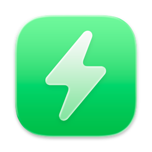

# 

<h1 align="center">AirBattery</h1>
<h3 align="center">Get battery usage of all devices on Mac and show them on the Dock / StatusBar / Widgets!

<b>Callie's Patch — v1.6.5</b>

This is a personally-patched fork with a batch of bug fixes and new features on top of the original project. See [CHANGELOG.md](https://github.com/callieskye/Air-Battery/blob/main/CHANGELOG.md) for the full list of what's changed. Highlights from this round:

- Fixed a real crash bug — the app could randomly quit or fail to launch, especially right after waking from sleep
- Fixed duplicate device rows showing up for the same Bluetooth accessory
- Fixed iPad/iPhone/Apple Watch battery only refreshing while the dropdown was open
- Fixed low-battery/fully-charged notifications never arriving for some devices
- Fixed AirPods Pro 2 (and other BLE-only accessories) disappearing entirely on macOS Sequoia
- Fixed the hover-state device row (time remaining / "mins ago" text) getting visually crushed into a single-character column for pinned devices with several action buttons showing at once
- Fixed a pinned menu-bar device's icon getting permanently stuck on the generic Bluetooth placeholder after its real device type resolved, instead of updating to match
- Fixed "Battery Level (Low to High)" sorting — a device reported *through* another device (like an Apple Watch via its paired iPhone) no longer gets stuck sorting by that other device's battery level instead of its own
- Fixed the Settings window sidebar being drag-resizable when it should be a fixed size
- Added: mute low-battery alerts per device, Low Power Mode toggle in the dropdown, "always show earbuds separately" option, Copy Device ID button, white widget background option, battery bar for pinned menu bar devices, and a device sort-order picker (name or battery level)
- Modernized: moved the minimum supported macOS version up to 14.0 and updated the codebase to match — modern SwiftUI navigation (`NavigationSplitView`), the newer two-value `onChange` API, and current IOKit constants, instead of carrying legacy fallback code for old macOS versions this build's users are unlikely to be on anyway

> Note: This build is signed "Sign to Run Locally" under a free personal Apple Developer account and is not notarized. Auto-updates are disabled — check back on this repo for new releases.

## Installation and Usage
### System Requirements:
- macOS 14.0 and Later *(raised from the original project's macOS 11.0 minimum, so this build could move onto modern SwiftUI/IOKit APIs instead of carrying legacy fallback code)*

### Usage: 
- After AirBattery is started, it will be displayed on both the Dock and the status bar by default, or only one of them (can be configured)  
- AirBattery will automatically search for all devices supported by the **"Nearbility Engine"** without manual configuration.  
- Click the Dock icon / status bar icon, or add a widget to view the battery usage of your devices.  
- You can also use the **"Nearcast"** feature to check the battery usage of other Macs and their peripherals in the LAN at any time.  
- You can also change the status bar icon to a real-time battery icon in preferences, just like the one that comes with the system.  
- If necessary, you can hide certain devices in the Dock menu or status bar menu, and unhide them at any time.  
- For devices pinned to the menu bar, you can show a battery bar graphic instead of a plain percentage (Settings → Display).
- Devices can be sorted by name or by battery level instead of discovery order (Settings → Display → Sorting).
- AirPods-style devices can be set to always show Case/Left/Right separately instead of merging when their levels are close (Settings → Nearbility).

## Q&A
**1. Why is my iPhone / iPad / Apple Watch not showing up?**
> Please make sure the iPhone / iPad has trusted this Mac ***(and connected the Mac with a data cable at least once while AirBattery is running to pair)***. Then just make sure it is on the same LAN as the Mac.  

**2. Does my Apple Watch need to be pre-connected?**
> No, when AirBattery detects a paired iPhone via WiFi or USB, it will automatically read the battery data of the Apple Watch paired with it **(iPhone discovered via Bluetooth does not support reading the watch battery!)** 

**3. Why do some device name have a ⚠️ symbol?**
> If this symbol appears, it means that the device has not updated its battery information for more than ten minutes, and may be offline or turned off.  

**4. My iPhone is not connected to WiFi, can I get the battery info?**
> Enable the **`iPhone / iPad(Cellular) over BT`** in the preferences, and keep the device's Bluetooth turned on ***(Only supports iPhone or cellular iPad!)***  

**5. Why does AirBattery need Bluetooth permission?**
> AirBattery needs Bluetooth to capture packets from peripheral devices in order to parse their battery information. On macOS Sequoia and later, this permission must be explicitly declared or the app may fail to detect any BLE-only accessories (like AirPods Pro 2) at all.

**6. I'm not getting low-battery notifications for a device.**
> Check that the device has an alert configured in its settings, and that it isn't muted via the speaker icon next to it in the device list. If you were on an older build, this was a known bug that's now fixed — devices past their notification cooldown will always get checked now instead of sometimes being silently skipped.

**7. Can I stop AirPods Case/Left/Right from merging into one row?**
> Yes — enable "Always show earbuds separately" in Settings → Nearbility to always show all three as distinct rows regardless of how close their battery levels are.

**8. I picked "Battery Level (Low to High)" and a device is still in the wrong spot.**
> This was a bug in earlier builds — some devices (like an Apple Watch, which reports its battery through its paired iPhone rather than directly) got stuck sorting by the *other* device's level instead of their own. It's fixed now; every device sorts independently by its own battery level in both directions.

